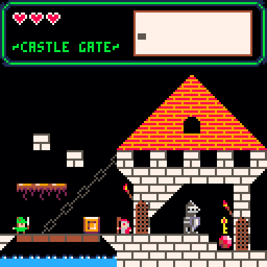

Castle est une cartouche [PICO-8](https://www.lexaloffle.com/pico-8.php).



## Prérequis

Installer PICO-8.

## Lancer la cartouche

Lancer PICO-8, et exécuter la commande `folder`. Cette commande ouvre le répertoire de vos cartouches PICO-8.

Copier la cartouche `carts/castle.p8` dans vos cartouches.

Chargez la cartouche et lancez la :
```
> load castle
> run
```

## Mode développement

Ce mode sert à éditer le code de la cartouche dans votre éditeur préféré.

### Indiquer où se trouve votre exécutable PICO-8

Pour démarrer, créer un fichier `.env` sur le modèle de `.env.example` qui indique où se trouve votre exécutable `pico8`. Ce fichier `.env` ne sera pas versionné.

## Lancer la cartouche

Ensuite, lancer PICO-8 avec :

```
make start-pico8
```

Une fois PICO-8 lancé, vous pouvez charger et lancer la cartouche :

```
> load castle
> run
```
